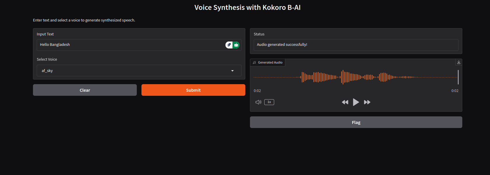

# Voice Synthesis with Kokoro B-AI

This project demonstrates a **voice synthesis system** using the `kokoro` library and `Gradio` for a user-friendly interface. It allows users to input text, select a voice, and generate synthesized speech, which can be played or downloaded.



## Features
- **Text-to-Speech**: Convert any text into speech using pre-trained voice models.
- **Multiple Voices**: Choose from a list of available voices.
- **User-Friendly Interface**: Powered by Gradio for an easy-to-use GUI.

## Requirements
To run this project, ensure you have the following installed:
- Python 3.8+
- PyTorch
- Gradio
- SoundFile

## Installation
1. Clone the repository:
   ```bash
   git clone https://github.com/hm-badhon/Play-With-TTS.git
   cd voice-synthesis-with-kokoro
   ```
2. Install dependencies:
   ```bash
   pip install -r requirements.txt
   ```

## How to Use
1. Run the main script:
   ```bash
   python main.py
   ```
2. Open the Gradio interface in your browser (automatically opens on launch).
3. Enter the text you want to synthesize.
4. Select a voice from the dropdown menu.
5. Generate and listen to the audio output.

## Download the pre-trained model from here

 [https://huggingface.co/hexgrad/Kokoro-82M/blob/main/kokoro-v0_19.pth] and keep the model in **models** folder.

## voice models 
 [https://huggingface.co/hexgrad/Kokoro-82M/blob/main/voices/af_sky.pt] and keep in **voices** folder.
## Directory Structure
```
.
├── models/                 # Pre-trained model files
├── voices/                 # Voice packs (.pt files)
├── main.py                 # Main script for running the app
├── requirements.txt        # Required Python packages
├── output_hmb.wav          # Generated audio output file
└── README.md               # Project documentation
```

## Example
Input text:
```
Welcome to Bangladesh.
```
Selected voice: `af_sky`

Generated audio: [output_hmb.wav](output_hmb.wav)

## Available Voices
- **af_sky**: Calm and soothing
- **af_ocean**: Dynamic and lively
- **af_mountain**: Deep and resonant

## Dependencies
Install the required Python libraries:
- [torch](https://pytorch.org/)
- [gradio](https://gradio.app/)
- [soundfile](https://pypi.org/project/SoundFile/)

## Future Improvements
- Add support for more languages.
- Include a feature to upload custom voice packs.
- Optimize for faster audio generation.

## Contribution
Contributions are welcome! Feel free to submit a pull request or open an issue.

## License
This project is licensed under the MIT License. See the LICENSE file for details.

---

Enjoy creating personalized voice synthesis with this easy-to-use tool!

